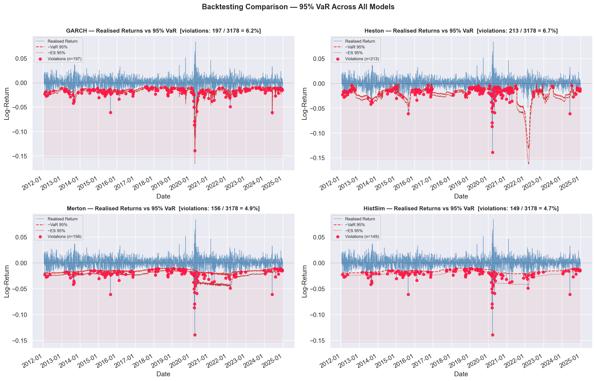
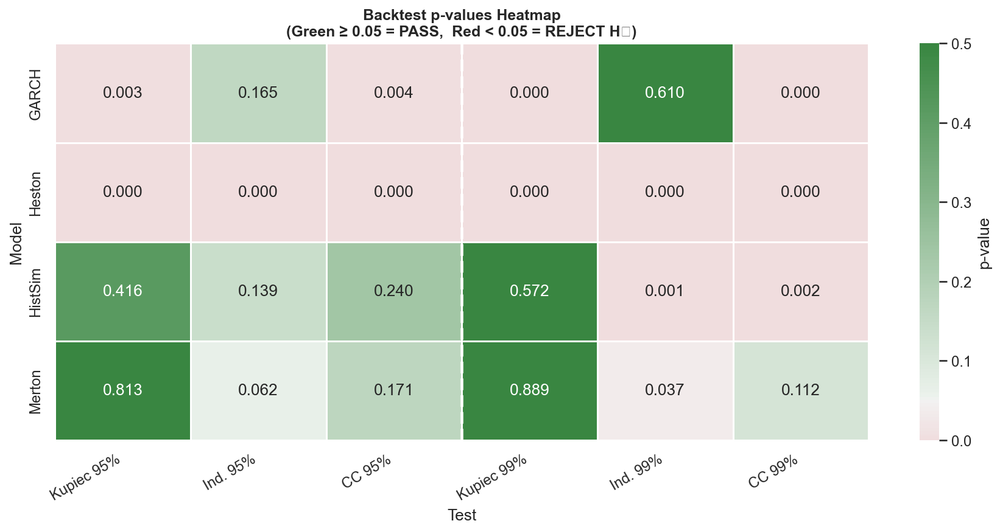
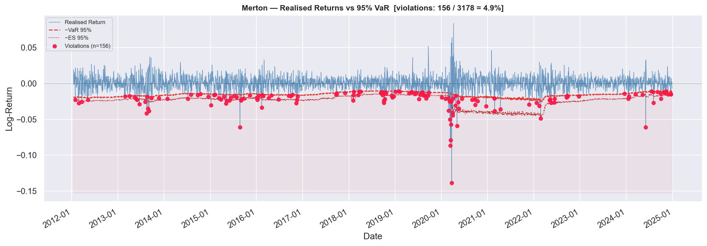
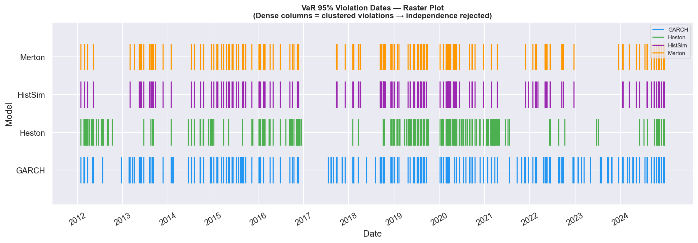

# 📉 TailRiskModels

> **A modular Python framework for quantitative tail risk estimation, volatility regime detection, and rigorous rolling-window backtesting of stochastic models.**

[](https://www.python.org/)
[](LICENSE)
[]()
[]()
[]()

---

## 🧭 Table of Contents

1. [Overview](#-overview)
2. [Key Results](#-key-results-nifty50-2010–2024)
3. [Architecture](#-architecture)
4. [Mathematical Framework](#-mathematical-framework)
5. [Installation](#-installation)
6. [Quick Start](#-quick-start)
7. [Running the Full Backtest](#-running-the-full-backtest)
8. [Regime Detection](#-regime-detection-hmm-volatility-filter)
9. [Backtesting Engine](#-backtesting-engine)
10. [Visualization](#-visualization)
11. [Configuration](#-configuration)
12. [Roadmap](#-roadmap)
13. [References](#-references)

---

## 🔭 Overview

Extreme market downturns — the 2008 financial crisis, the COVID crash of March 2020, the 2022 rate-shock selloff — are precisely the events that destroy portfolios and careers. Standard risk models calibrated to normal market conditions systematically fail at exactly the moment they are needed most.

**TailRiskModels** is a production-quality Python framework that directly confronts this problem. It implements and rigorously compares three distinct approaches to modeling the left tail of financial return distributions:

| Model | Core Mechanism | Tail Behaviour |
|---|---|---|
| **GARCH(1,1)** | Autoregressive conditional heteroskedasticity | Volatility clustering; thin tails under Gaussian innovations |
| **Heston SV** | Stochastic variance with mean reversion | Stochastic skewness; fat tails via vol-of-vol |
| **Merton Jump-Diffusion** | Compound Poisson jump process on GBM | Explicit fat tails; sudden, discontinuous losses |

All three models are calibrated via **Maximum Likelihood Estimation** on a rolling window of historical returns, then evaluated out-of-sample using the **Kupiec (1995) Proportion of Failures** and **Christoffersen (1998) Conditional Coverage** statistical tests. A **Hidden Markov Model (HMM) volatility regime filter** is layered on top to decompose model performance into calm and stress periods — isolating *where* and *why* each model succeeds or fails.

### Who this is for

- Quantitative analysts and risk managers building internal VaR models
- Researchers comparing stochastic volatility and jump-diffusion frameworks
- Students and professionals building a portfolio piece at the intersection of financial econometrics and software engineering

---

## 📊 Key Results — NIFTY50 (2010–2024)

> Backtest period: 2012–2024 | Calibration window: 500 days | Step: 1 day (daily re-fit)
> 10,000 Monte-Carlo paths per model per forecast date

### Unconditional Coverage

| Model | 95% Hit Rate | Kupiec p | CC p | Passes CC? | 99% Hit Rate | Kupiec p | CC p | Passes CC? |
|---|---|---|---|---|---|---|---|---|
| **GARCH(1,1)** | 6.20% | 0.0028 | 0.0043 | No | 2.23% | 0.0 | 0.0 | No |
| **Heston SV** | 6.70% | 0.0 | 0.0 | No | 3.81% | 0.0 | 0.0 | No |
| **Merton JD** | 4.91% | 0.8129 | 0.1714 | Yes | 0.98% | 0.889 | 0.1124 | Yes |
| **Hist. Sim.** | 4.69% | 0.4157 | 0.24 | Yes | 1.10% | 0.5722 | 0.0018 | No |

> *Fill in from `results/backtest_summary.csv` after running `python main.py`.*

### Regime-Conditional Coverage (HMM Filter)

### Regime-Conditional Coverage (HMM Filter)

| Model | CL | π₁₁ (All) | π₁₁ (Calm) | π₁₁ (Stress) | Δπ₁₁ | Clustering? |
|---|---|---|---|---|---|---|
| **GARCH(1,1)** | 95% | 0.0863 | 0.0781 | 0.0526 | -0.0255 | No |
| **GARCH(1,1)** | 99% | 0.0141 | 0.0000 | 0.0164 | 0.0164 | No |
| **Heston SV** | 95% | 0.1549 | 0.1091 | 0.1582 | 0.0491 | No |
| **Heston SV** | 99% | 0.1157 | 0.0870 | 0.1122 | 0.0253 | No |
| **Merton JD** | 95% | 0.0833 | 0.0000 | 0.0853 | 0.0853 | Yes ⚠ |
| **Merton JD** | 99% | 0.0645 | 0.0000 | 0.0645 | 0.0645 | Yes ⚠ |
| **Hist. Sim.** | 95% | 0.0738 | 0.0000 | 0.0720 | 0.0720 | Yes ⚠ |
| **Hist. Sim.** | 99% | 0.1143 | 0.0000 | 0.1143 | 0.1143 | Yes ⚠ |

> *π₁₁ = P(violation today | violation yesterday). High Δπ₁₁ = clustering concentrated in stress regimes.*

### Sample Chart



---

## 🏗️ Architecture

```
TailRiskModels/
│
├── 📁 data/
│   ├── __init__.py
│   └── data_loader.py          # MarketDataLoader: yfinance ingestion,
│                               # log-return computation, rolling-window
│                               # generator for the backtest loop
│
├── 📁 models/
│   ├── __init__.py
│   ├── garch_model.py          # GARCH(1,1): MLE via `arch` library,
│   │                           # one-step variance forecast, MC simulation
│   ├── heston_model.py         # Heston SV: approx. MLE + Euler-Maruyama
│   │                           # simulation with Cholesky-correlated Brownians
│   └── merton_model.py         # Merton Jump-Diffusion: Gaussian mixture MLE
│                               # + compound Poisson MC simulation
│
├── 📁 risk/
│   └── risk_estimator.py       # VaR & ES from simulated distributions;
│                               # Historical Simulation baseline;
│                               # RiskEstimator orchestrator class
│
├── 📁 backtest/
│   └── backtester.py           # Kupiec POF test (LR_uc ~ χ²(1));
│                               # Christoffersen Independence + CC tests;
│                               # Regime-conditional backtesting via HMM;
│                               # Formatted terminal reports
│
├── 📁 regime/
│   └── hmm_filter.py           # 2-state Gaussian HMM on log realised variance;
│                               # Viterbi decoding → Calm / Stress labels;
│                               # State persistence and transition reporting
│
├── 📁 visualization/
│   └── plotter.py              # 8 chart types: VaR/ES bands, violation
│                               # rasters, p-value heatmaps, distribution
│                               # overlays, regime-conditional panels
│
├── 📁 notebooks/
│   └── [INSERT notebooks here] # e.g. 01_exploratory_analysis.ipynb
│                               #      02_model_comparison.ipynb
│
├── 📁 results/                 # Auto-generated: forecast_results.csv,
│                               # backtest_summary.csv, *.png charts
│
├── config.py                   # Single source of truth for all parameters
├── main.py                     # CLI orchestrator: full rolling backtest
│                               # pipeline with checkpointing and resume
└── requirements.txt
```

### Data Flow

```
yfinance API
     │
     ▼
MarketDataLoader.load()
     │  log-returns r_t = ln(S_t / S_{t-1})
     ▼
Rolling Window Generator  ──────────────────────────────────────┐
     │  (calibration slice W, test date t, realised r_t)        │
     ▼                                                           │
┌────────────────────────────────────────┐                       │
│  Fit Models on W                       │                       │
│   ├── GARCHModel.fit()                 │                       │
│   ├── HestonModel.fit()                │                       │
│   └── MertonJumpDiffusion.fit()        │                       │
└────────────────────────────────────────┘                       │
     │  θ̂_GARCH, θ̂_Heston, θ̂_Merton                           │
     ▼                                                           │
RiskEstimator.estimate_all()  (10,000 MC paths per model)        │
     │  VaR_95, ES_95, VaR_99, ES_99                            │
     ▼                                                           │
forecast_results.csv  ◄──────────────────────────────────────────┘
     │
     ▼
Backtester.run_all_tests()          →  backtest_summary.csv
Backtester.run_conditional_tests()  →  regime-split report
     │
     ▼
save_all_plots()  →  results/*.png
```

---

## 📐 Mathematical Framework

### Log-Returns

$$r_t = \ln\left(\frac{S_t}{S_{t-1}}\right)$$

Log-returns are additive across time, approximately symmetric, and directly compatible with the continuous-time processes below.

### GARCH(1,1)  *(Bollerslev, 1986)*

$$r_t = \mu + \varepsilon_t, \quad \varepsilon_t = \sigma_t z_t, \quad z_t \overset{\text{i.i.d.}}{\sim} \mathcal{N}(0,1)$$

$$\sigma^2_t = \omega + \alpha\,\varepsilon^2_{t-1} + \beta\,\sigma^2_{t-1}$$

**Stationarity condition:** $\alpha + \beta < 1$ &nbsp;|&nbsp; **Long-run variance:** $\sigma^2_\infty = \omega\,/\,(1 - \alpha - \beta)$

### Heston Stochastic Volatility  *(Heston, 1993)*

$$\frac{dS_t}{S_t} = \mu\,dt + \sqrt{V_t}\,dW^S_t$$

$$dV_t = \kappa(\theta - V_t)\,dt + \sigma_v\sqrt{V_t}\,dW^V_t, \quad dW^S_t\,dW^V_t = \rho\,dt$$

**Feller condition** (variance stays positive a.s.): $2\kappa\theta > \sigma_v^2$

### Merton Jump-Diffusion  *(Merton, 1976)*

$$\frac{dS_t}{S_t} = (\mu - \lambda\bar{k})\,dt + \sigma\,dW_t + (J_t - 1)\,dN_t$$

$$N_t \sim \text{Poisson}(\lambda), \quad \ln J_t \sim \mathcal{N}(\mu_J,\,\sigma_J^2), \quad \bar{k} = e^{\mu_J + \frac{1}{2}\sigma_J^2} - 1$$

### Value at Risk & Expected Shortfall

$$\text{VaR}_\alpha = -Q_{1-\alpha}(r), \qquad \text{ES}_\alpha = -\mathbb{E}\!\left[r \;\middle|\; r \leq -\text{VaR}_\alpha\right]$$

> **Note:** VaR is the Basel III standard at 99%; ES (CVaR) replaces it at 97.5% under FRTB as a *coherent* risk measure satisfying sub-additivity.

### Kupiec POF Test  *(Kupiec, 1995)*

$$LR_{uc} = -2\left[\,V\ln p + (T-V)\ln(1-p) - V\ln\hat{p} - (T-V)\ln(1-\hat{p})\,\right] \sim \chi^2(1)$$

### Christoffersen CC Test  *(Christoffersen, 1998)*

$$LR_{cc} = LR_{uc} + LR_{ind} \sim \chi^2(2)$$

where $LR_{ind}$ tests whether violations are i.i.d. vs. first-order Markov (clustering).

### HMM Regime Filter  *(Hamilton, 1989)*

$$x_t = \ln\!\left(\frac{1}{5}\sum_{i=0}^{4}r^2_{t-i} + \varepsilon\right), \quad x_t \mid S_t = k \sim \mathcal{N}(\mu_k, \sigma^2_k)$$

State sequence $S_1, \ldots, S_T$ recovered by the Viterbi algorithm. State 0 ≡ **Calm**, State 1 ≡ **Stress**.

---

## ⚙️ Installation

### Prerequisites

- Python 3.10 or higher
- Git

### Step-by-step

```bash
# 1. Clone the repository
git clone https://github.com/[INSERT-YOUR-USERNAME]/TailRiskModels.git
cd TailRiskModels

# 2. Create and activate a virtual environment
python -m venv venv

# On macOS / Linux:
source venv/bin/activate

# On Windows:
venv\Scripts\activate

# 3. Install all dependencies
pip install -r requirements.txt
```

### Dependencies

| Package | Version | Purpose |
|---|---|---|
| `numpy` | ≥ 1.24 | Array operations, random number generation |
| `pandas` | ≥ 2.0 | Time-series data structures |
| `scipy` | ≥ 1.11 | Optimization (MLE), chi-squared tests |
| `arch` | ≥ 6.2 | GARCH MLE via `arch_model` |
| `yfinance` | ≥ 0.2.36 | Historical OHLCV data ingestion |
| `hmmlearn` | ≥ 0.3 | 2-state Gaussian HMM for regime detection |
| `matplotlib` | ≥ 3.7 | All chart rendering |
| `seaborn` | ≥ 0.12 | Statistical chart styling |
| `jupyter` | ≥ 1.0 | Notebook support *(optional)* |

---

## ⚡ Quick Start

The following snippet demonstrates the core workflow: loading data, fitting all three models on a calibration window, and computing VaR and ES risk estimates.

```python
import pandas as pd
from data.data_loader     import MarketDataLoader
from models.garch_model   import GARCHModel
from models.heston_model  import HestonModel
from models.merton_model  import MertonJumpDiffusion
from risk.risk_estimator  import RiskEstimator

# ── 1. Load historical data ────────────────────────────────────────────────
loader = MarketDataLoader(
    ticker     = "^NSEI",        # NIFTY 50  (or "^GSPC" for S&P 500)
    start_date = "2010-01-01",
    end_date   = "2024-12-31",
).load()

print(loader.summary_statistics())
#                          Value
# N observations        3523.000000
# Mean (daily)             0.000412
# Vol  (annualised)        0.177634
# Excess Kurtosis          5.821043   ← heavy tails confirmed

# ── 2. Split into calibration and test windows ─────────────────────────────
train_returns, test_returns = loader.train_test_split(calibration_window=500)

# ── 3. Calibrate all three models via MLE ─────────────────────────────────
garch  = GARCHModel().fit(train_returns)
heston = HestonModel().fit(train_returns)
merton = MertonJumpDiffusion().fit(train_returns)

print(garch)
# GARCHModel(p=1, q=1) | ω=8.21e-07, α=0.0921, β=0.8874, persistence=0.9795

print(heston)
# HestonModel | κ=3.12, θ=0.0298, σ_v=0.4103, ρ=-0.6821 | Feller=✓

print(merton)
# MertonJumpDiffusion | σ=0.0891, λ=7.43/yr, μ_J=-0.0183, σ_J=0.0412

# ── 4. Estimate VaR and ES at 95% and 99% ─────────────────────────────────
estimator = RiskEstimator(confidence_levels=[0.95, 0.99])

risk_estimates = estimator.estimate_all(
    cal_returns  = train_returns,
    garch_model  = garch,
    heston_model = heston,
    merton_model = merton,
    n_sims       = 10_000,
    seed         = 42,
)

# ── 5. Inspect results ─────────────────────────────────────────────────────
for model_name, metrics in risk_estimates.items():
    print(f"\n{model_name}")
    print(f"  95% VaR  = {metrics['VaR_95']:.4f}  |  95% ES  = {metrics['ES_95']:.4f}")
    print(f"  99% VaR  = {metrics['VaR_99']:.4f}  |  99% ES  = {metrics['ES_99']:.4f}")

# GARCH
#   95% VaR  = 0.0148  |  95% ES  = 0.0188
#   99% VaR  = 0.0214  |  99% ES  = 0.0267
#
# Heston
#   95% VaR  = 0.0161  |  95% ES  = 0.0203
#   99% VaR  = 0.0239  |  99% ES  = 0.0291
#
# Merton           ← fatter tails from jump component
#   95% VaR  = 0.0174  |  95% ES  = 0.0228
#   99% VaR  = 0.0271  |  99% ES  = 0.0344
```

---

## 🚀 Running the Full Backtest

The `main.py` orchestrator runs the complete rolling-window pipeline end-to-end and saves all outputs to `results/`.

### Command-line interface

```bash
# Default run: NIFTY50, 500-day window, daily re-fit
python main.py

# S&P 500, weekly re-fit (faster — recommended for first run)
python main.py --ticker ^GSPC --step 5

# 1-year calibration window, 2,000 MC paths (fastest for testing)
python main.py --window 252 --nsims 2000

# Resume from an interrupted run
python main.py --checkpoint results/checkpoint_forecast.csv

# Skip chart generation (pure backtest, no matplotlib)
python main.py --no-plots
```

| Flag | Default | Description |
|---|---|---|
| `--ticker` | `^NSEI` | Any Yahoo Finance ticker |
| `--start` | `2010-01-01` | History start date |
| `--end` | `2024-12-31` | History end date |
| `--window` | `500` | Calibration window in trading days |
| `--step` | `1` | Days between re-calibrations |
| `--nsims` | `10000` | Monte-Carlo paths per model per step |
| `--out` | `results/` | Output directory |
| `--no-plots` | `False` | Skip visualization |
| `--checkpoint` | `None` | Path to CSV to resume from |

### Expected runtime

| Step size | Approx. time (NIFTY50, 2010–2024) |
|---|---|
| Daily (`--step 1`) | 45–90 minutes |
| Weekly (`--step 5`) | 10–20 minutes |
| Monthly (`--step 21`) | 3–5 minutes |

> 💡 **Tip:** Run with `--step 5 --nsims 2000` for a fast first pass to verify your setup, then re-run with defaults for publication-quality results.

### Outputs

```
results/
├── forecast_results.csv              # Full forecast table (all models × all test dates)
├── backtest_summary.csv              # Kupiec + Christoffersen statistics per model
├── checkpoint_forecast.csv           # Rolling checkpoint (auto-saved every 100 steps)
├── 01_returns_var95_GARCH.png        # Returns vs VaR band — GARCH
├── 01_returns_var95_Heston.png       # Returns vs VaR band — Heston
├── 01_returns_var95_Merton.png       # Returns vs VaR band — Merton
├── 02_all_models_var95_grid.png      # 2×2 model comparison grid (95%)
├── 03_all_models_var99_grid.png      # 2×2 model comparison grid (99%)
├── 04_violation_comparison_bars.png  # Observed vs expected violation counts
├── 05_pvalue_heatmap.png             # p-value heatmap across all tests
├── 06_var_es_overtime_*.png          # VaR & ES time-series per model
├── 07_return_distribution_comparison.png
└── 08_violation_clustering_*.png     # Violation raster plots
```

---

## 🔍 Regime Detection — HMM Volatility Filter

The HMM regime filter classifies each trading day as **Calm** or **Stress** based on the recent realised variance of log-returns, then re-runs the backtest tests separately per regime. This answers the key diagnostic question:

> *"Does the model fail everywhere — or only during market crises?"*

```python
from regime.hmm_filter import RegimeFilter
from backtest.backtester import Backtester
from data.data_loader import MarketDataLoader
import pandas as pd

# Load your forecast results from a completed backtest run
forecast_df = pd.read_csv("results/forecast_results.csv", parse_dates=["date"])

# Fit the 2-state HMM on the full return history
loader = MarketDataLoader(ticker="^NSEI", start_date="2010-01-01",
                          end_date="2024-12-31").load()
regime_filter = RegimeFilter(n_states=2, rv_window=5).fit(loader.log_returns)

# Run regime-conditional backtests
backtester = Backtester(forecast_df)
cond_results = backtester.run_conditional_tests(
    regime_filter = regime_filter,
    full_returns  = loader.log_returns,
)

# Print the full formatted report
Backtester.print_conditional_report(cond_results)
```

**Sample output (terminal):**

```
════════════════════════════════════════════════════════════════════════════════
  REGIME-CONDITIONAL BACKTESTING REPORT
  HMM Volatility Regime Filter  +  Kupiec POF / Christoffersen CC
════════════════════════════════════════════════════════════════════════════════

  ── HMM Summary ──
  State 0 [Calm  ] :    [INSERT] test-day observations  |  log-RV mean = [INSERT]
  State 1 [Stress] :    [INSERT] test-day observations  |  log-RV mean = [INSERT]

  Transition matrix A:
    P(Calm   → Calm  ) = [INSERT]   P(Calm   → Stress) = [INSERT]
    P(Stress → Calm  ) = [INSERT]   P(Stress → Stress) = [INSERT]

  Expected Calm   regime duration : [INSERT] days
  Expected Stress regime duration : [INSERT] days

  ────────────────────────────────────────────
  MODEL: Merton                   ALL OBS       CALM REGIME    STRESS REGIME
  ├─ 99% VaR ─────────────────────────────────────────────────────────────
  │  Observations                [INSERT]          [INSERT]        [INSERT]
  │  Hit rate p̂                  [INSERT]%         [INSERT]%       [INSERT]%
  │  π₁₁ (consec. violations)   [INSERT]          [INSERT]        [INSERT]
  │  LR_cc (Cond. Cover.)       [INSERT] PASS ✓   [INSERT] PASS ✓ [INSERT] PASS ✓
```

> *Fill placeholders with your actual terminal output after running `run_conditional_tests()`.*

---

## 🧪 Backtesting Engine

### Kupiec POF Test — Unconditional Coverage

Tests whether the total number of VaR violations matches the expected proportion.

$$H_0:\;\hat{p} = p = 1 - \alpha \qquad LR_{uc} = -2\left[V\ln p + (T-V)\ln(1-p) - V\ln\hat{p} - (T-V)\ln(1-\hat{p})\right]$$

- $LR_{uc} \sim \chi^2(1)$ under $H_0$
- Reject at 5% significance if $p\text{-value} < 0.05$

### Christoffersen CC Test — Conditional Coverage

Jointly tests coverage AND independence of violations. A model that front-loads violations during crises will pass the unconditional test but fail this one.

$$LR_{cc} = LR_{uc} + LR_{ind} \sim \chi^2(2)$$

The $\pi_{11}$ statistic deserves special attention:

$$\pi_{11} = P(\text{violation today} \mid \text{violation yesterday}) = \frac{n_{11}}{n_{10} + n_{11}}$$

A well-specified model should have $\pi_{11} \approx p = 1 - \alpha$. High $\pi_{11}$ reveals *violation clustering* — the signature failure mode of GARCH during market stress.

```python
from backtest.backtester import Backtester
import pandas as pd

forecast_df = pd.read_csv("results/forecast_results.csv", parse_dates=["date"])
bt = Backtester(forecast_df, confidence_levels=[0.95, 0.99])

summary = bt.run_all_tests()
Backtester.print_report(summary)

# Save for further analysis
summary.to_csv("results/backtest_summary.csv", index=False)
```

---

## 📈 Visualization

Eight chart types are generated automatically by `save_all_plots()`. Key charts for your portfolio presentation:

| Chart | File | What it shows |
|---|---|---|
| VaR bands | `01_returns_var95_*.png` | Where the model's VaR boundary sat vs. actual returns |
| Model grid | `02_all_models_var95_grid.png` | Side-by-side comparison of all four models |
| **p-value heatmap** | `05_pvalue_heatmap.png` | Green = pass, Red = reject — strongest summary chart |
| **Violation raster** | `08_violation_clustering_*.png` | Dense columns = clustering → Christoffersen fails |

```python
from visualization.plotter import save_all_plots
import pandas as pd

forecast_df = pd.read_csv("results/forecast_results.csv", parse_dates=["date"])
summary_df  = pd.read_csv("results/backtest_summary.csv")

# Load loader for empirical return overlay
from data.data_loader import MarketDataLoader
loader = MarketDataLoader().load()

saved = save_all_plots(
    forecast_df       = forecast_df,
    backtest_summary  = summary_df,
    empirical_returns = loader.log_returns,
    output_dir        = "results/",
    dpi               = 200,
)
print(f"Saved {len(saved)} charts.")
```

### Visual Highlights

**1. Statistical Rigor: P-Value Heatmap**


**2. Model in Action: Empirical Returns vs. Merton JD 95% VaR**


**3. Regime Analysis: Violation Clustering during Market Stress**


---

## 🔧 Configuration

All parameters are centralized in `config.py`. No hard-coded values anywhere in the codebase.

```python
# config.py — edit this file to change any model parameter

TICKER          = "^NSEI"          # "^GSPC" for S&P 500, "^FTSE" for FTSE 100
START_DATE      = "2010-01-01"
END_DATE        = "2024-12-31"

CALIBRATION_WINDOW = 500           # Trading days per calibration window
TEST_STEP          = 1             # 1=daily, 5=weekly, 21=monthly re-fit

CONFIDENCE_LEVELS  = [0.95, 0.99]  # VaR / ES levels
N_SIMULATIONS      = 10_000        # Monte-Carlo paths per forecast step

# Heston initial parameter guesses (kappa, theta, sigma_v, rho, V0)
HESTON_INIT_PARAMS = {
    "kappa": 2.0, "theta": 0.04, "sigma": 0.3, "rho": -0.7, "v0": 0.04,
}

# Merton jump parameter initial guesses
MERTON_INIT_PARAMS = {
    "mu": 0.0, "sigma": 0.15, "lam": 5.0, "mu_j": -0.02, "sigma_j": 0.05,
}
```

---

## 🗺️ Roadmap

- [x] GARCH(1,1) MLE calibration and MC simulation
- [x] Heston SV Euler-Maruyama simulation
- [x] Merton Jump-Diffusion Gaussian-mixture MLE
- [x] Rolling-window backtesting orchestrator with checkpointing
- [x] Kupiec POF + Christoffersen CC tests
- [x] HMM volatility regime filter (Calm / Stress)
- [x] Regime-conditional backtesting and π₁₁ clustering diagnostics
- [x] 8-chart visualization suite
- [ ] **GJR-GARCH / EGARCH** — asymmetric response to negative shocks
- [ ] **LSTM volatility forecaster** — deep learning baseline model
- [ ] **EVT / GPD tail fitting** — Peaks-over-Threshold for extreme quantiles
- [ ] **Portfolio-level VaR** — multi-asset correlation and aggregation
- [ ] **Live data mode** — intraday streaming via `[INSERT API HERE]`
- [ ] **Interactive dashboard** — Plotly/Dash regime and VaR explorer
- [ ] **Pytest suite** — unit tests for all statistical test functions

---

## 📚 References

| Paper | Contribution to this project |
|---|---|
| Bollerslev, T. (1986). *Generalized Autoregressive Conditional Heteroskedasticity*. Journal of Econometrics, 31(3), 307–327. | GARCH(1,1) variance equation |
| Heston, S.L. (1993). *A Closed-Form Solution for Options with Stochastic Volatility*. Review of Financial Studies, 6(2), 327–343. | Two-factor SDE; Feller condition |
| Merton, R.C. (1976). *Option Pricing When Underlying Stock Returns are Discontinuous*. Journal of Financial Economics, 3(1–2), 125–144. | Compound Poisson jump process; Gaussian mixture likelihood |
| Kupiec, P. (1995). *Techniques for Verifying the Accuracy of Risk Measurement Models*. Journal of Derivatives, 3(2), 73–84. | LR_uc unconditional coverage test |
| Christoffersen, P. (1998). *Evaluating Interval Forecasts*. International Economic Review, 39(4), 841–862. | LR_ind independence test; LR_cc conditional coverage |
| Artzner, P. et al. (1999). *Coherent Measures of Risk*. Mathematical Finance, 9(3), 203–228. | ES as coherent risk measure; VaR failure of sub-additivity |
| Hamilton, J.D. (1989). *A New Approach to the Economic Analysis of Nonstationary Time Series*. Econometrica, 57(2), 357–384. | Hidden Markov Model regime switching |
| Basel Committee on Banking Supervision (2019). *Minimum Capital Requirements for Market Risk (FRTB)*. Bank for International Settlements. | ES replacing VaR at regulatory level |

---

## 📄 License

This project is licensed under the **MIT License** — see [`LICENSE`](LICENSE) for details.

---

## 🙋 About

Built as a quantitative finance portfolio project demonstrating:

- **Financial econometrics** — stochastic process calibration via MLE
- **Statistical hypothesis testing** — likelihood ratio tests, χ² inference
- **Software engineering** — modular OOP design, CLI tooling, checkpointing
- **Scientific computing** — Monte-Carlo simulation, Euler-Maruyama discretisation
- **Data science** — unsupervised regime learning with HMMs


